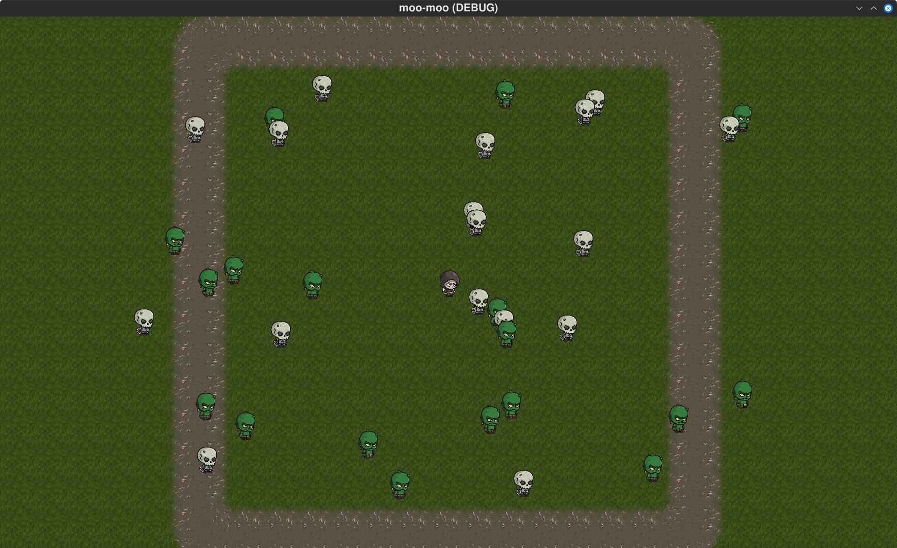
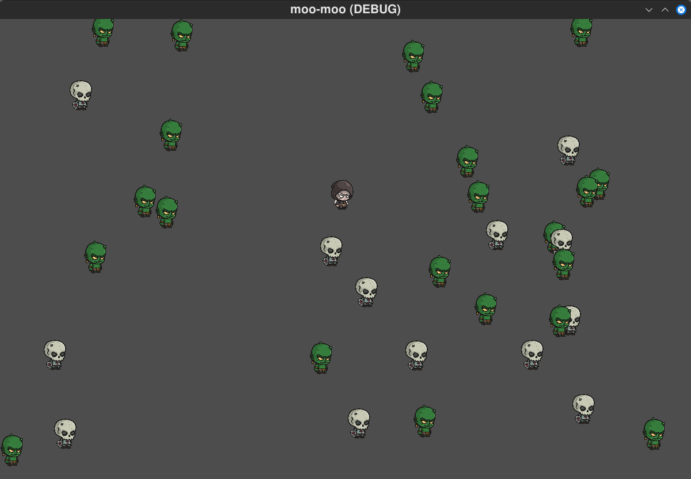
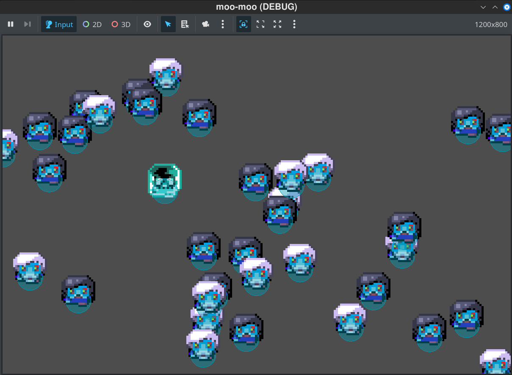

# [Moo Moo]

Welcome to **[Moo Moo]**! 🚀  
This is an open-source project built with **Godot 4.4**. Feel free to explore, modify, and contribute!

## Features
- [Feature 1]
- [Feature 2]
- [Feature 3]

## 🚀 Getting Started
1. Clone the repository:
   ```bash
   git clone https://github.com/LucasJappert/my-first-game-with-godot
   ```
2. Open the project in **Godot 4.4**.
3. Run the project and start exploring!

## 🤝 Contributing
We welcome contributions! To contribute:
1. Fork the repository.
2. Create a new branch (`git checkout -b feature-name`).
3. Commit your changes (`git commit -m "Add feature"`).
4. Push the branch (`git push origin feature-name`).
5. Open a **Pull Request**.

## 📜 License
This project is licensed under the **MIT License**. See the [LICENSE](LICENSE) file for details.

## 💡 Contact
If you have any questions, feel free to reach out!

## 📸 Screenshots

- 2025-03-08


- 2025-03-07

